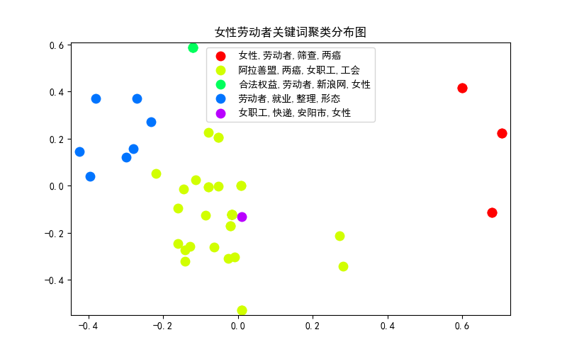

# 新浪新闻爬取与事件聚类

## 1.新闻爬取

用于爬取新浪新闻网上的新闻文本数据的Python库有：

```python
import requests
import json
import xlwt
from bs4 import BeautifulSoup
```

通过下面这段代码，可以实现根据关键词在搜索页爬取多页数据，包含`新闻url，新闻标题，消息来源，发布时间`：

```python
params = {"t": "", "q": self.kw, "pf": "0", "ps": "0", "page": page, "stime": "2020-01-01", "etime": "2022-07-13", "sort": "rel", "highlight": "1", "num": "10", "ie": "utf-8"}
response = requests.get("https://interface.sina.cn/homepage/search.d.json?", params=params, headers=headers)
dic = json.loads(response.text)
```


通过下面这段代码，可以实现根据爬取的新闻url进行文本数据爬取。对于两类url进行爬取，一类为以`https://finance.sina.com.cn`开头构造的url，一类为以`https://k.sina.com.cn`开头构造的url。

```python
def extract_news(self, url, title, type):
    header = {'user-agent': 'Mozilla/5.0'}
    try:
        r = requests.get(url, headers=header)
        r.raise_for_status()
        r.encoding = r.apparent_encoding
        # print(r.text)
        soup = BeautifulSoup(r.text, features='lxml')
        news = []
        if type == 'f':
            arti = soup.find_all(id="artibody")
            for para in arti[0].find_all('p'):
                if para.string is not None:
                    news.append(para.string.strip())
        elif type == 'k':
            arti = soup.find_all(id="article")
            news.append(arti[0].text.strip())

        with open(os.path.join(self.path, title + '.txt'), 'w', encoding='utf-8') as f:
            f.write(title + '\n')
            f.writelines(news)
            print("Successfully save 《{}》!".format(title))
    except:
        print("error {}".format(url))
```

## 2.新闻事件聚类

常见的新闻分类往往利用深度学习中的文本分类技术，分类目的是向受众按类别推荐新闻，往往是“娱乐”、“体育”、“政治”这样的大类。而本次分析则是根据新闻标题以及新闻正文中的关键词进行新闻事件的聚类。例如对于“女性劳动者”这一话题下的新闻，提取了诸如“两癌,女性,筛查,内蒙古自治区”、“两癌,筛查,女职工,宫颈癌”这样的关键词，就有可能将其划分为一类新闻事件。

具体方法为先对文本进行关键词提取，再利用TF-IDF算法对关键词进行向量化，将词频矩阵送入K-Means模型进行聚类。K-Means算法会将数据集分为K个簇，每个簇使用簇内所有样本均值来表示，是一种无监督学习的聚类算法。

用于新闻事件聚类的Python库有：

```python
import jieba.analyse
from sklearn.feature_extraction.text import CountVectorizer
from sklearn.feature_extraction.text import TfidfTransformer
from sklearn.cluster import KMeans
from sklearn.decomposition import PCA
```


通过下面的代码，可以实现新闻文本的关键词提取：

```python
tags = jieba.analyse.extract_tags(content, topK=4)
```


通过下面的代码，可以实现根据关键词的新闻事件聚类，除去可视化部分，这里展示了如何将关键词进行向量化，并压缩维度，方便聚类结果的观察，这部分代码参考了这个[Github](https://github.com/pengLP/sina_analysis)库：

## 数据分析结果

选取关键词“女性劳动者”，绘制新闻事件聚类结果：


